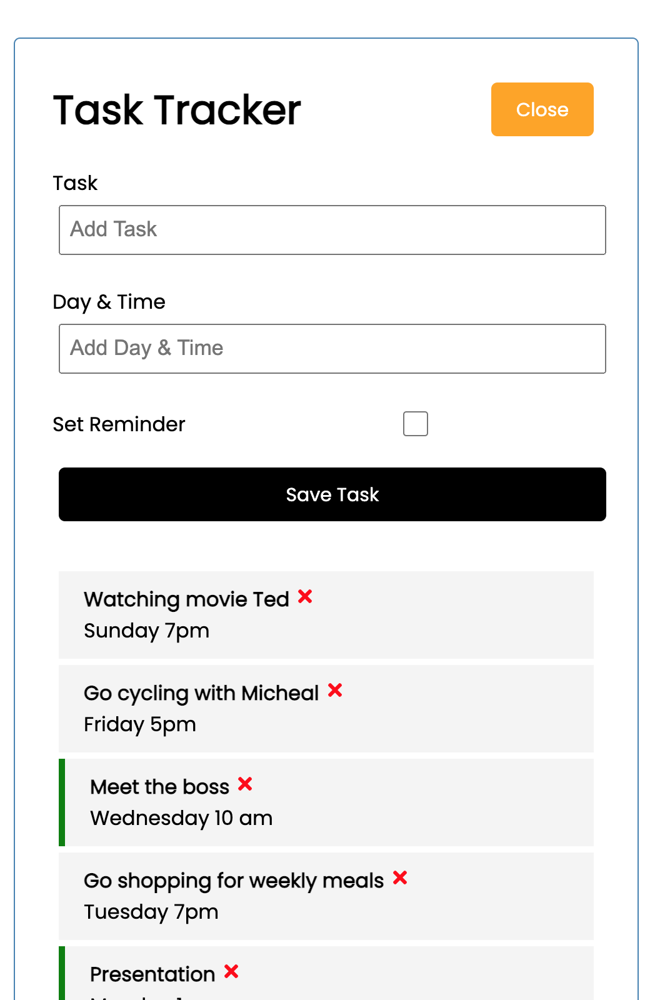
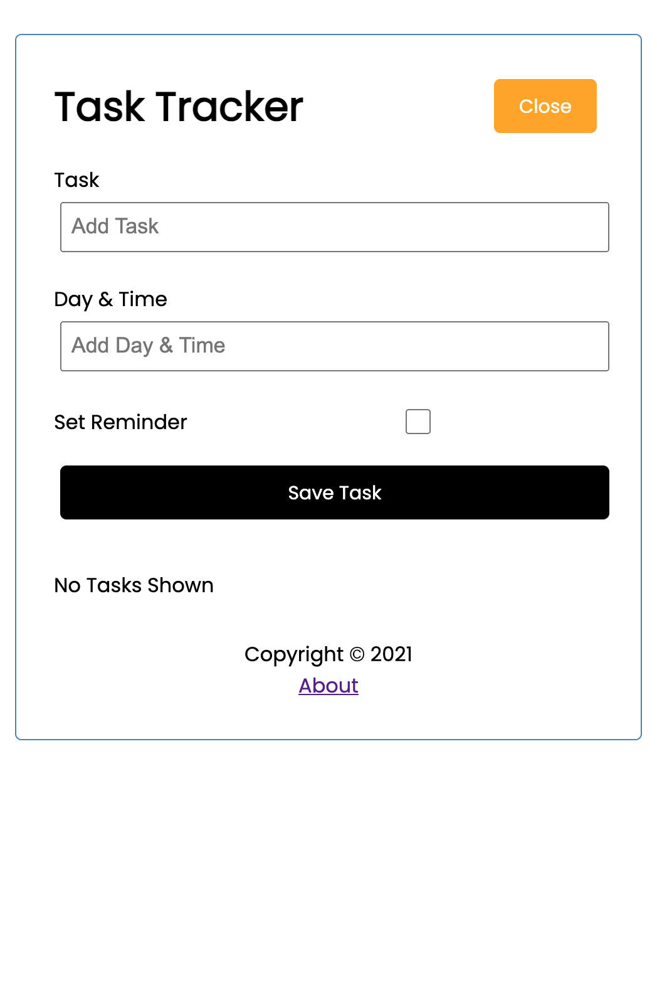
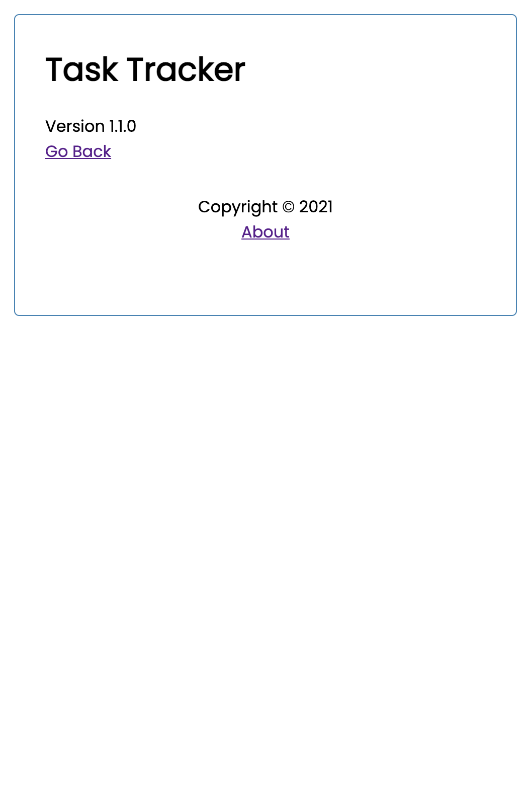

# Task tracker React

## About this app
This is a simple app built by ReactJS and designed to help user manage daily tasks with features such as adding and deleting tasks, toggle the reminder option for each task.

## Screenshots
  

## Get started
#### Start mock JSON server
- install the mock JSON server using command `npm install -g json-server`
- run server in local port 6100 using `json-server --watch db.json -p 6100`
#### Run app in development mode
- using `npm start` to run app in development mode
#### Run app in production mode
- build the app for production to the "build" folder using `node run build`
- using a local http server to deploy app on by first installing Node serve `npm install -g serve`,
and then run `serve -s build`. It will run on default port 5000
